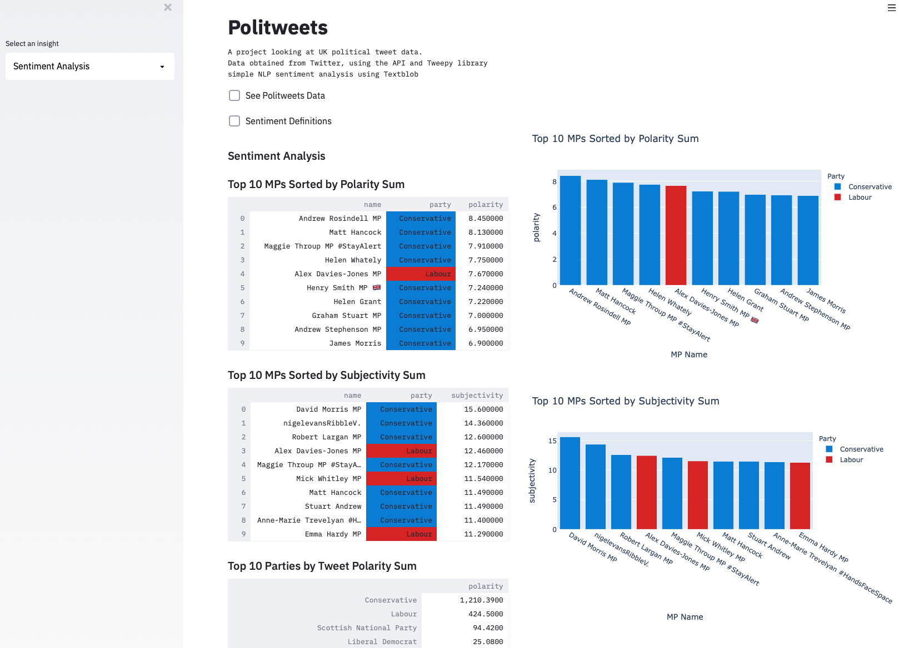

# Politweets
Politweets scrapes UK politician tweets using the Twitter API &amp; Tweepy. Sentiment analysis applied via Textblob and presented using Streamlit.

# Preview



# Table of Contents

- [Project Title](#Politweets)
- [Installation](#Installation)
- [Data](#Data)
- [Code](#Code)
- [Licence](#Licence)

# Installation

1. Start by cloning the repository:
```
git clone https://github.com/ChristopherBacon/Politweets.git
cd politweets
```
2. Create a python 3.73 environment.

3. Install dependencies

```
pip install requirements.txt
```
If you want to scrape your own tweet data you will need to register for a twitter API key and register your project. The code that is commented out contained in: [twitter_api.py](twitter_api.py), you can follow a tutorial and register for an API [here](https://developer.twitter.com/en/docs/twitter-api/tutorials).

To view the data in Streamlit:
```
streamlit run TweepyMPs.py
```
You can also access helper functions to investigate the data further in the module: [twitter_handles_list.py](twitter_handles_list.py) and [TweepyMPs.py](TweepyMPs.py)

# Data

1. ```politweets.csv``` The csv containing all of the scraped tweets, with polarity and subjectivity features
2.```MPs_twitter.csv``` The csv containing all of the MPs twitter handles as used with Tweepy when scraping tweets. Party data also used. This is a great resource downloadable from [Politics Social](https://www.politics-social.com)

# Code

1.[twitter_api.py](twitter_api.py) Contains the functions to access Twitter API and scrape data with Tweepy. Finally saving the data to ```politweets.csv```

2.[twitter_handles_list.py](twitter_handles_list.py) Functions to clean Twitter handles and create politcal party column

3.[TweepyMPs.py](TweepyMPs.py) Polarity, Subjectivity and design functions along with the bulk of the Streamlit code to format display properties

# Conclusion & References


